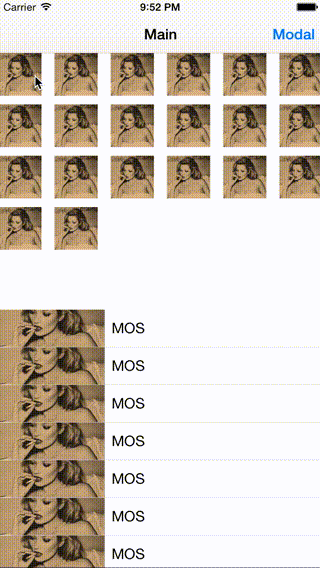

# ARNZoomImageTransition

Custom image zooming animation transition. (Swift lang)

## Requirements

* Xcode 6.4
* iOS 8.1+
* Swift lang 1.2

## License

ARNZoomImageTransition is available under the MIT license. See the LICENSE file for more info.
